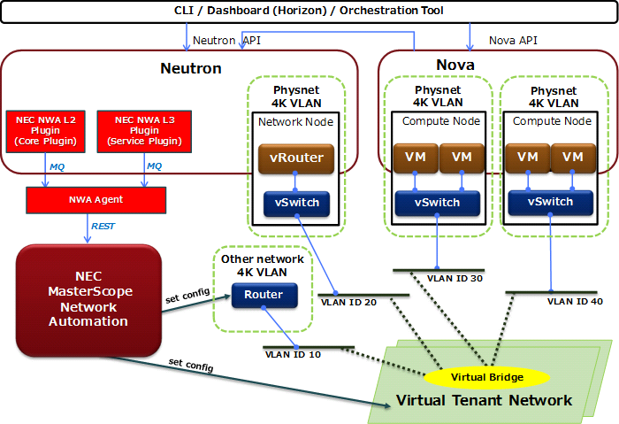

==============================
Introduction of NEC NWA plugin
==============================

.. toctree::
   :maxdepth: 1

   Installation <installation>
   Settings <settings>
   DevStack support <devstack>

The NWA plugin consists of plugin driver and agent.
Using this plugin, you can operate an SDN controller (MasterScope
Network Automation) made by NEC from OpenStack CLI or Dashboard.

NWA can build a large scale layer 2 network which removes the 4K VLAN
limit.
So you can use the NWA plugin to create, update and delete the network
through OpenStack environment.

