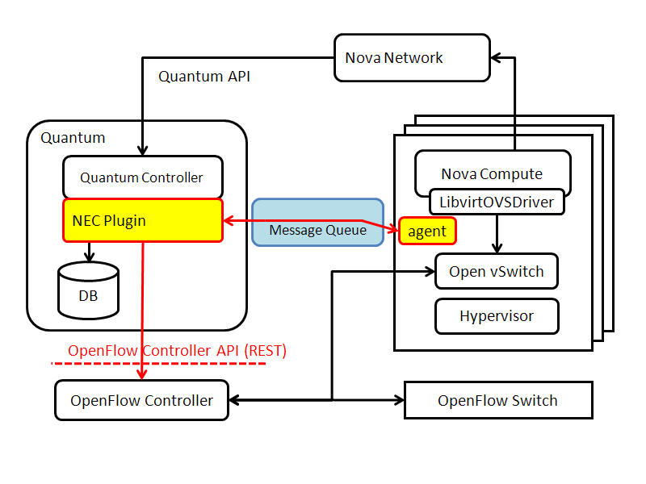

============
Introduction
============

NEC OpenFlow plugin talks to OpenFlow Controller and each Neutron
would be mapped to an virtual layer-2 network slice on an OpenFlow
enabled network. The interface between the Neutron plugin and OpenFlow
Controller is RESTful API. This API is supported by two
implementations:

* `NEC ProgrammableFlow Controller <http://www.necam.com/SDN/>`_ (NEC Commercial Product)
* `Trema Sliceable Switch <https://github.com/trema/apps/tree/master/sliceable_switch>`_ (OSS)

This plugin consists of two components:

* **Plugin**: It processes Neutron API calls and controls OpenFlow
  controller to handle logical networks on OpenFlow enabled network.

* **Layer2-Agent**: It runs on each compute node. It gathers a mapping
  beween a VIF and a switch port from local Open vSwitch and reports
  it to the plugin.

